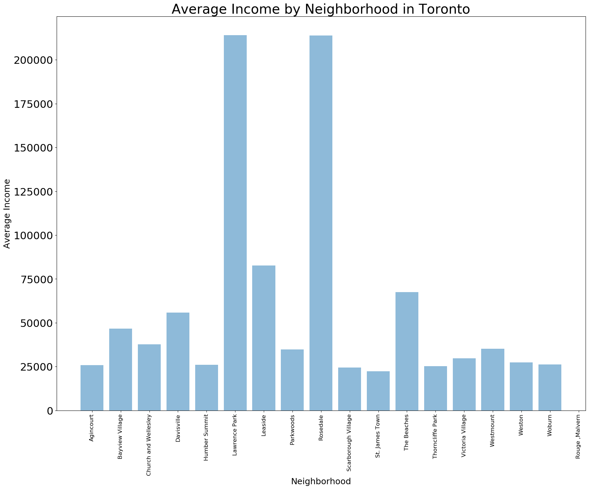

# Introduction

"Toronto is the provincial capital of Ontario and the most populous city in Canada, with a population of 2,731,571 as of 2016. Current to 2016, the Toronto census metropolitan area (CMA), of which the majority is within the Greater Toronto Area (GTA), held a population of 5,928,040, making it Canada's most populous CMA. The city is the anchor of the Golden Horseshoe, an urban agglomeration of 9,245,438 people (as of 2016) surrounding the western end of Lake Ontario. Toronto is an international centre of business, finance, arts, and culture, and is recognized as one of the most multicultural and cosmopolitan cities in the world".[1]

"The diverse population of Toronto reflects its current and historical role as an important destination for immigrants to Canada. More than 50 percent of residents belong to a visible minority population group, and over 200 distinct ethnic origins are represented among its inhabitants. While the majority of Torontonians speak English as their primary language, over 160 languages are spoken in the city."[1]

As you will see in the report, the demographics will be compared among various neighborhoods about the population, race and income. Also, you will find a detailed report about the shops and restaurants distribution. This will provide information to help new residents to know the city and their neighborhoods, especially during the process of house hunting.

# Data Description

To provide the information as mentioned we acquire a list of data as following:

1. Location data for Toronto neighborhoods, source: https://en.wikipedia.org/wiki/List_of_postal_codes_of_Canada:_M and http://cocl.us/Geospatial_data.
2. Venues data, source: Forsquare API used to get the most common venues of given Borough of Toronto.
3. Population density and average income data for Toronto, source: https://en.wikipedia.org/wiki/Demographics_of_Toronto and https://en.wikipedia.org/wiki/Demographics_of_Toronto_neighbourhoods. 

# Methodology
In this study, I used python folium library to visualize geographic details of Toronto and its boroughs and I created a map of Toronto with neighborhoods. Summary statistics and bar chart were provided to compare the venue category among various neighborhoods. Also, the summary statistics were provided to explore the differences in income level, race and other demographics among various neighborhoods. I used unsupervised learning K-means algorithm to cluster the neighborhoods K-Means algorithm is one of the most common cluster method of unsupervised learning. I will run K-Means to cluster the neighborhoods into k clusters because where I analyze the K-Means with elbow method to choose the optimum k of the K-Means.

# Results
I utilized the Foursquare API to explore the neighborhoods and segment them. I designed the limit as 100 venue and the radius 500 meter for each borough from their given latitude and longitude information. Here is a head of the list Venues name, category, and latitude and longitude information from Foursquare API.

The above bar chart shows a clear visualization for the neighborhoods with most and least number of venues. In summary of this graph 266 unique categories were returned by Foursquare, then I created a table which shows list of top 10 venue category for each neighborhood as in below table.

We have some common venue categories in neighborhoods. So we can use K-means algorithm to cluster the neighborhoods. To choose the optimal k for the K-means, we used Silhouette Value-versus-k plot as below. The optimal k is 8.

And below is the merged table with cluster labels, neighborhoods and their common venues.

Here is a map of Toronto neighborhoods colored by various clusters.

We can also visualize the number of 1st Most Common Venue in each cluster by creating a bar chart.

We also got data of Toronto demographics of neighborhoods, which could be used to provide us ideas about the income level, renter’s percentage and population in various neighborhoods.

#	Discussion
Toronto is a diverse city with a high population density. The population densities and measurements vary across neighborhoods. I used the K-means algorithm as part of this clustering study. When I tested the Elbow method, I set the optimum k value to 7. However, the clustering is not ideal, with most of neighborhoods clustered in one cluster. 
Visualization of the clustering information was provided through a bar chart and Toronto map. We also found from the demographics across various neighborhoods that population, income level and renter percentage is unequally distributed. The least populated neighborhoods, Lawrence Park and Rosedale, have the highest average income level. While the most populated neighborhoods, Agincourt and Woburn, are among the neighborhoods with top least income level. The neighborhoods with least renter’s percentage are Lawrence Park and Agincourt. 

#	Conclusion
Toronto is a diverse and highly populated city. We found the heterogeneous distributions in population, income level and renter percentage across various neighborhoods. Also, the distribution of different restaurants and shops vary across the neighborhoods. To know more about this city’s various neighborhoods, a further analysis with other data is needed to evaluate the diversity and culture in Toronto.

# References:
1.	https://en.wikipedia.org/wiki/Toronto

